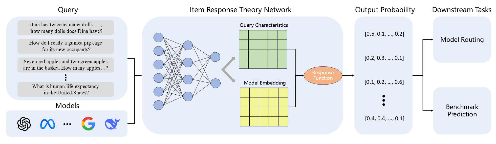
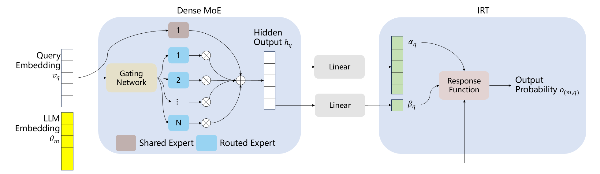

# IrtNet: Learning Compact Representations of LLM Abilities via Item Response Theory

This is the repository for our arxiv paper [Learning Compact Representations of LLM Abilities via Item Response Theory](https://arxiv.org/abs/2510.00844). Compact LLM Embeddings can be used for downstream tasks like Model Routing and Benchmark Prediction.



Our architecture comprises of a dense MoE layer which captures the feature of queries and an IRT layer which trains LLM Embeddings based on item response theory.




## Installation
Clone this repository
```
git clone https://github.com/JianhaoChen-nju/IrtNet.git
cd IrtNet
```

Create and activate the conda environment:
```
conda create --name IrtNet python=3.11
conda activate IrtNet
pip install -r requirements.txt
```

## Dataset

Data can be found at [https://huggingface.co/datasets/JianhaoNJU/IrtNet-Dataset](https://huggingface.co/datasets/JianhaoNJU/IrtNet-Dataset).

Our data is mostly the same  as [EmbedLLM](https://arxiv.org/abs/2410.02223)'s. Specially, we applied a majority vote to consolidate multiple answers from a model to the same query. 
If the number of 0s and 1s is the same, we prioritize 1. 
This step ensures a unique ground truth for each model-query pair, which is especially critical for the test set. 
For example, if a single question in the test set has two ground truths (0 and 1 respectively), predicting either 0 or 1 for this question will result in a 50% score, which makes the test case meaningless.

The datasets contain 35,673 queries from 10 public benchmarks, including [ASDiv](https://arxiv.org/abs/2106.15772), 
[GPQA](https://arxiv.org/abs/2311.12022), [GSM8K](https://arxiv.org/abs/2110.14168), [MathQA](https://arxiv.org/abs/1905.13319), [LogiQA](https://arxiv.org/abs/2007.08124), 
[MedMCQA](https://arxiv.org/abs/2203.14371), [MMLU](https://arxiv.org/abs/2304.12986), [SocialIQA](https://arxiv.org/abs/1904.09728), [PIQA](https://arxiv.org/abs/1911.11641), 
and [TruthfulQA](https://arxiv.org/abs/2109.07958). 
The correctness of answers from 112 open-source language models to those queries  was evaluated. 
The queries were converted into 768-dimensional embeddings using the all-mpnet-base-v2 sentence transformer. 
The queries were split into a training set of 29,673 queries, a validation set of 3,000 queries, and a test set of 3,000 queries.

We prepare a script to download the dataset:
```
cd data
python download_data.py
```

To transform the benchmark questions into embeddings:

```
cd data
python get_question_embedding_tensor.py
```

## Train and Evaluate


Train IrtNet model and run downstream tasks (model routing and in-domain correctness prediction):
```
./pipeline.sh
```
If you just wanna test with trained model, add ```--eval_only``` to ```.\pipeline.sh```.

To run out-of-domain benchmark prediction:
```
cd src
python benchmark_prediction.py
``` 


## Citation

```
@article{
  chen2025learning,
  title={Learning Compact Representations of LLM Abilities via Item Response Theory},
  author={Chen, Jianhao and Wang, Chenxu and Zhang, Gengrui and Ye, Peng and Bai, Lei and Hu, Wei and Qu, Yuzhong and Hu, Shuyue},
  journal={arXiv preprint arXiv:2510.00844},
  year={2025}
}
```
